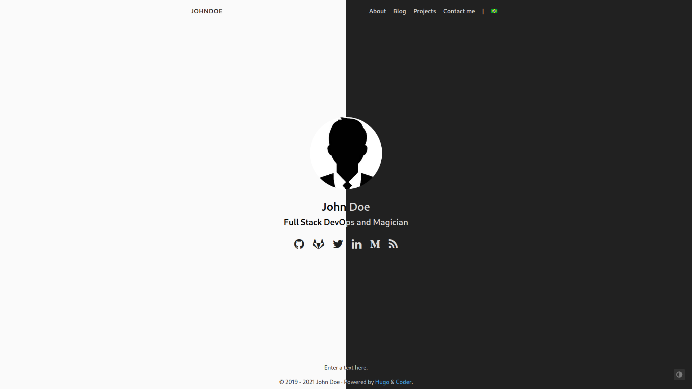

  

    
    
  

  

    
  

A simple and clean blog theme for [Hugo](https://gohugo.io/).

## Live Demo

See [here](https://hugo-coder.netlify.app/).

## Quick Start

1. Add the repository into your Hugo Project repository as a submodule, `git submodule add https://github.com/luizdepra/hugo-coder.git themes/hugo-coder`.
2. Configure your `config.toml`. You can either use [this minimal configuration](https://github.com/luizdepra/hugo-coder/wiki/Configurations#complete-example) as a base, or look for a complete explanation about all configurations [here](https://github.com/luizdepra/hugo-coder/wiki/Configurations). The [`config.toml`](https://github.com/luizdepra/hugo-coder/blob/master/exampleSite/config.toml) inside the [`exampleSite`](https://github.com/luizdepra/hugo-coder/tree/master/exampleSite) is also a good reference.
3. Build your site with `hugo server` and see the result at `http://localhost:1313/`.

## Documentations

See [`docs`](docs/home.md) folder.

## License

Coder is licensed under the [MIT license](https://github.com/luizdepra/hugo-coder/blob/master/LICENSE.md).

## Maintenance

This theme is maintained by its author [Luiz de Prá](https://github.com/luizdepra) with the help from these awesome [contributors](CONTRIBUTORS.md).

## Sponsoring

If you like my project or it was useful for you, consider supporting its development. Just:

## Special Thanks

- Gleen McComb, for his great [article](https://glennmccomb.com/articles/how-to-build-custom-hugo-pagination/) about custom pagination.
- All contributors, for every PR and Issue reported.
